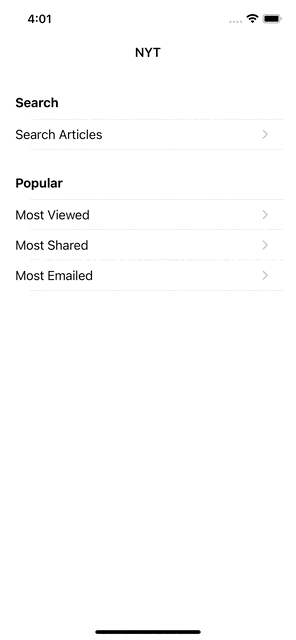

# NYTimes-Articles-iOS

NYTimes Articles app is simple app. This application will be helpful for someone who wants to explore about MVVM, Unit testing and UITesting.
App implemented with iOS and swift framework, third-pary libraies are not added. Its pure iOS and Swift app.

# Features!
  - Search Articles
  - Most Viewed Articles
  - Most Shared Articles
  - Most Emailed Articles

# Technical Specification!
  - XCode
  - iOS 13.0+
  - Simulator or iOS device

iOS XCTest framework is used for Unit and UI testing.

POM(Page Object Model) pattern used For UI Testing.

### Example
Potrait                    |  Landscape
:-------------------------:|:-------------------------:
             |  

### Project Overview
 MVVM                    | Unit Test                 | UI Test
:-----------------------:|:-------------------------:|:-------------------------:
 |  | 

### Unit test and UI test result

Unit Test Result         |  UI Test Result
:-----------------------:|:-------------------------:
| 

License
-------

    Copyright 2022 Shahul Hameed Shaik

    Licensed under the Apache License, Version 2.0 (the "License");
    you may not use this file except in compliance with the License.
    You may obtain a copy of the License at

       http://www.apache.org/licenses/LICENSE-2.0

    Unless required by applicable law or agreed to in writing, software
    distributed under the License is distributed on an "AS IS" BASIS,
    WITHOUT WARRANTIES OR CONDITIONS OF ANY KIND, either express or implied.
    See the License for the specific language governing permissions and
    limitations under the License.
